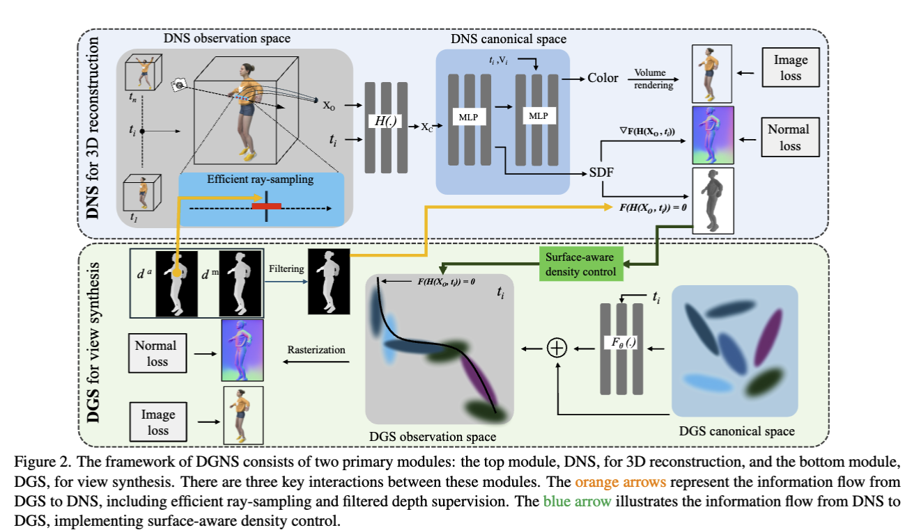

# DGNS: Deformable Gaussian Splatting and Dynamic Neural Surface for Monocular Dynamic 3D Reconstruction





## Citetation
```
@article{li2024dgns,
  title={DGNS: Deformable Gaussian Splatting and Dynamic Neural Surface for Monocular Dynamic 3D Reconstruction},
  author={Li, Xuesong and Tong, Jinguang and Hong, Jie and Rolland, Vivien and Petersson, Lars},
  journal={arXiv preprint arXiv:2412.03910},
  year={2024}
}
```
